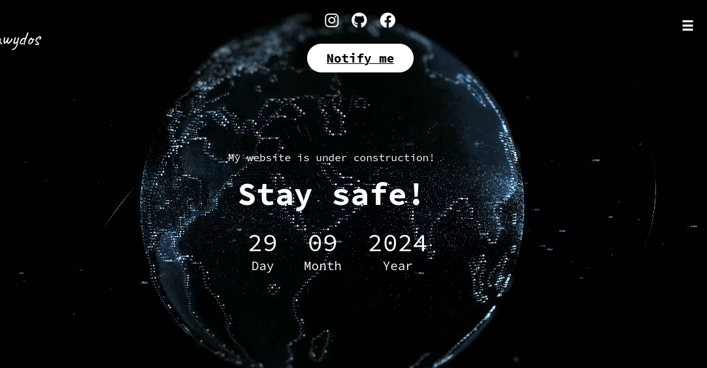
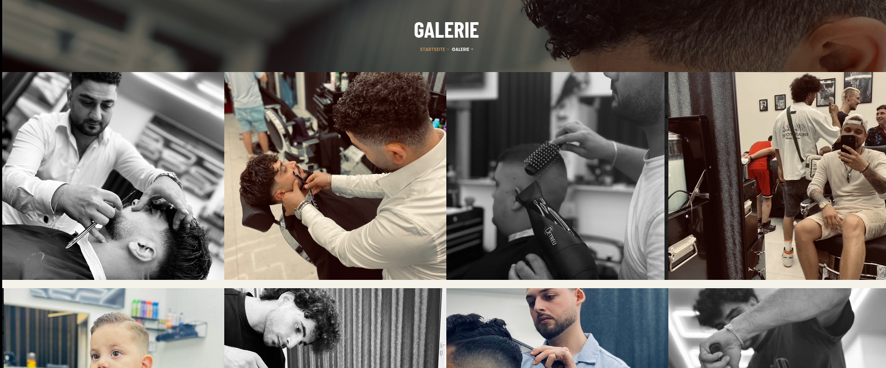

# Willkommen auf meiner Webseite! 🌐

Mein Name ist **Dawydos (Dawid)** 👨🏽‍💻. Nach **acht Jahren** umfangreicher Erfahrung im Bereich **Kryptowährungen** – spezialisiert auf **Geldwäscheprävention** und **Masternode-Programmierung** – habe ich mit **30 Jahren** entschieden, ein neues Kapitel in meinem Leben zu beginnen und ein **Studium** im Bereich **Software- und Webentwicklung** zu starten. 

Aktuell erweitere ich mein Wissen, das ich mir im Kryptobereich selbst angeeignet habe, und kombiniere es mit fundierten Kenntnissen, um innovative Lösungen in der **Webentwicklung** zu schaffen. 🚀 Nebenbei entwickle ich Webseiten, Software und alles, was mit **IT** zu tun hat.

In meinem Content teile ich meine Ansichten zu **Bitcoin**, **Programmierung** und **kritischen politischen Themen** 🤯. Ihr findet mich unter dem Benutzernamen **dawydos** auf **GitHub**, **Instagram** und **TikTok**. Mein Ziel ist es, nicht nur Wissen zu vermitteln, sondern auch eine positive Einstellung zu fördern und vielleicht ein Lächeln ins Gesicht zu zaubern! 😄

## Ein Geschenk für ein guten Freund 🎁

Für einen Freund, den ich während meines Studiums kennengelernt habe, habe ich eine **Webseite** kostenlos als Geschenk erstellt. Es war eine großartige Gelegenheit, meine Fähigkeiten in der Praxis anzuwenden und gleichzeitig einem Freund zu helfen. 

## Danke für deine Aufmerksamkeit! 🙏

Bleib gesund,glücklich & CyberSafe ✌🏽!

